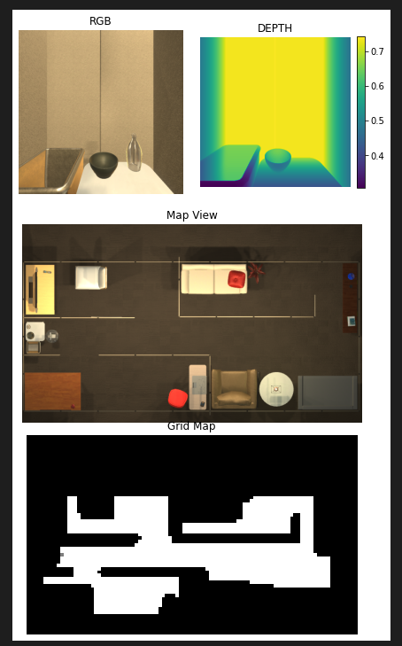
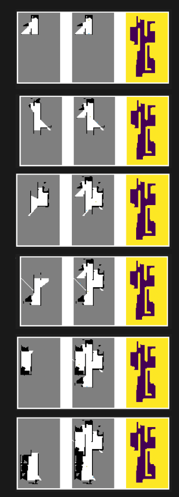
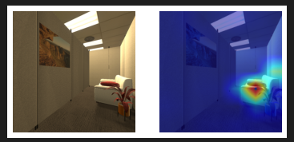
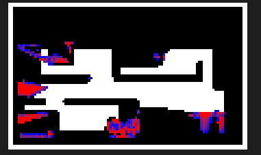

# CoW-Reproduce

This repository is reproduction of CLIP on Wheels: Zero-Shot Object Navigation as Object Localization and Exploration.
[Original Paper](https://arxiv.org/abs/2203.10421)

We leverage Frontier Based Exploration (FBE) for searching and gradCAM of CLIP for localization.
We did not implement other exploration methods like DD-PPO, nor localization method like k-patch and language based.

[FBE](https://dl.acm.org/doi/pdf/10.1145/280765.280773), [GradCAM](https://openaccess.thecvf.com/content_iccv_2017/html/Selvaraju_Grad-CAM_Visual_Explanations_ICCV_2017_paper.html), [CLIP](https://arxiv.org/abs/2103.00020)

### Install
```
pip install -r requirements.txt
```

### Reproduce Results

**Reproduce**

Query Objects: CellPhone, Laptop, Book, Apple, AlarmClock, Pot, Pillow, RemoteControl, CD, Mug, PepperShaker, TeddyBear, SprayBottle

Sucess on recognizing the query object in 2.5 meters.

**Original Paper**

Query Objects: AlarmClock, Apple, BaseballBat, BasketBall, Bowl, GarbageCan, HousePlant, 
Laptop, Mug, SprayBottle, Television, Vase

Sucess on recognizing the query object in 1.5 meters.

|    -        |      SPL    | Sucess Rate |
| ----------- | ----------- | ----------- |
| Reproduce| 0.147    |  0.467      |
| paper | 0.100      |  0.163      |

### DEMO
You can check demo.ipynb for visualization

Initial frame and map will look like 


**Map extension using Frontier based Search**


**The result of searching**

CAM result



Map Localization Result


